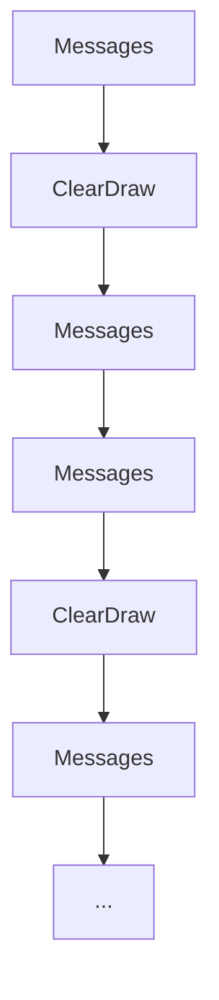
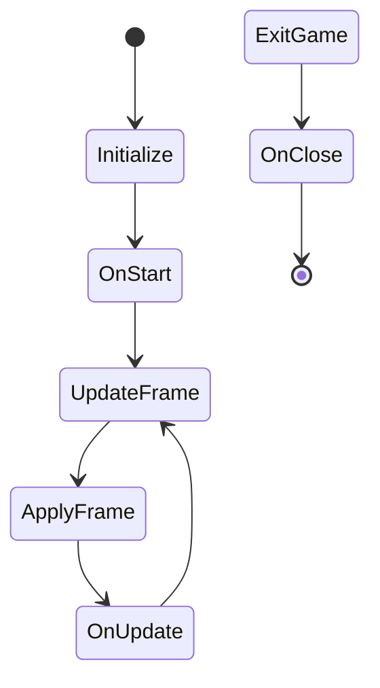

## What is Game Design? 
Described in a way I feel both simple and somewhat poetic, game design (or game development) is the interdisciplinary art of bringing artificial worlds to life. Much like a Game Manager for board games and TTRPGs, Game Designers seek to immerse their players in a world, and provide an experience for their players to enjoy. 

<div style="page-break-after: always;"></div>

More technically speaking, game designers work to convert abstract games, to real world technologies. If you’ve ever heard of games such as Dungeons and Dragons, Starfinder, Chess, Uno, or almost any other game, you’ve *likely* seen the poetic role of a game designer. Those games boast enjoyable experiences – experiences which consist of rules, a playing field, and interactions between the game and the player. 

Take the Dungeon Master of a game such as Dungeons and Dragons for instance. They create a world in concept, and fill it with details big and small: they create characters, places, scenarios, events, cultures, and fun little quirks for their world. They simulate the actions and behaviors of Non-Playable Characters for the players to interact with. They describe the things players see, and try to immerse players in a world that is both real and alive. They handle the rules of the game, making sure they’re properly communicated, and that they’re actually enforced. 

The DM (Dungeon Master) in this instance is maintaining a game, but the game is abstract. The game exists and runs and continues *only* with someone (our DM) helping to manifest it. They have to keep track of the details, and ensure the fulfillment of all aspects in the game. 

With our above definition then, we can say that a Game Developer, or GD, seeks to convert the abstract game into a real game. A game that contains within itself the content that it needs to run, and performs all the roles necessary to maintain the game, leaving only a role for a player’s input. You might argue that the game still isn’t “real” as it’s on a computer, but you must remember that everything the game keeps track of still exists within the computer. It’s real, it’s just a real *representation* rather than a real actualization of the game and its contents into our world. It just so happens that computers are extremely good at following specified instructions and repeating computations, unlike a human. 

To make all this happen, a Game Developer needs to construct and convey the rules of the game to a computer. This is what programming is actually about, and is what becomes the bread and butter of some of the coolest parts of game development. Programming is about designing instructions that a computer can run. That’s all. 

But conveying every aspect of a game is, in honesty, tiresome. Consider again, our Dungeon Master. A DM has many things they have to handle, and there are some things which are simply too lengthy or complex to easily convey completely. If a DM spent their time describing the number of trees in every valley, and the hairs on every NPC, and the color of every person’s clothing, they would never be able to get to actually running their game. To help manage this, a DM has two options: Either they make everything they have to manage simpler skipping over all of the smaller details, or they make use of tools to assist them. The latter approach is why a DM has references in the form of published worlds, rules, and stories, assets in the form of minifigs and pictures to represent characters and items, and tools for generating and deciding outcomes such as dice and tables. 

As people who are trying to convert this abstract game into a real one, Game Developers run into the same issues as a DM. It’s completely possible to design the rules for drawing characters onto the screen, and the rules for how the computer processes every “frame” or instant of the game, and the rules for how the computer should interact with the hardware, and how to scale and resize the window, and so on. However, as it’s tedious, taking this approach, depending on the depth, will often make the game harder and harder to complete. 

Instead, there are tools for the development of games, which aim to make this easier, much the same as a DM might be given. Tools such as Unity, Godot, and Unreal Engine are all tools known as “Game Engines”. They are programs and development spaces that have been designed for Game Developers, by Game Developers, and contain much of the needed functionality. This allows a Game Developer to just setup some settings, and begin writing the parts of the program they actually care about. 

And, once again like a DM, a Game Developer could work to convey every rule and detail of the characters and models in their world, stating the placement of the pixels, or the shape of the 3D model. However, a Game Developer could alternatively use an aspect of many Game Engines for what are called assets. Assets are just things like textures, images, 3D models, shapes, and so on, that can be developed in other specialized programs or software, and then imported into the Game Engine for use. 

To run over that, we have a few things introduced:
+ Game Developer – People who make game rules and ideas real
+ Programming – conveying the rules and functionality of a game to a computer
+ Game Engine – Toolkit to make game development easier
+ Assets – Objects and files made for use in a Game Engine. 

These things are the real focus of game design. 

When designing a game with a Game Engine, a Game Developer can work with many concepts related to game design – such as player characters, assets, worlds, levels, game menus, and more – being a given. They are simply there and usable. This is the benefit of a Game Engine, and throughout this writing (or series of writings, if needed) these same benefits will be assumed. 

## Programming 
### READ THE DOCS!!!!!!!
Programming is the art of communicating instructions to a computer. Upon receiving them, the computer will follow those instructions, regardless of whether they are well thought out, or well designed, or even doable. Additionally, since programming deals with communicating instructions in *computer programming languages* rather than in *English* it can be easy to make mistakes, and not notice them. 

It’s with these details in mind that I preface this by saying: don’t expect to perfectly remember or understand all details of programming or your Game Engine just by learning about them. 

Developing a good sense on what a program should look like requires reasonable programming experience and knowledge of the language (and its conventions), and developing a natural feel for navigating around any tool set (especially those as large as a Game Engine) requires years of hands on experience and wondering what in tarnation is going on. 

Instead of expecting to immediately and exactly understand or know something, look up the documentation for it. This is one of the most critical and important abilities a programmer, or technical fellow in general, can have. Be able to accept when you don’t or might not know something, and know how to figure it out. 

For programming languages and game engines, these are tools designed to be used, and are constantly updated. For that reason, they have expansive documentation, across multiple sources (including the creators of the content). 
+ [C# Docs](https://learn.microsoft.com/en-us/dotnet/csharp/)
+ [C++](https://devdocs.io/cpp/)
+ [Unity](https://docs.unity.com/)
+ [Godot](https://docs.godotengine.org/en/stable/index.html)
+ [Unreal Engine](https://docs.unrealengine.com/5.1/en-US/)

Do not be afraid to reference the documentation, do not be afraid to experiment with examples and ideas from the documentation. It is your friend, and even years into programming I will pull up a quick reference or some old code to know what I’m talking about. Of course, *you’re* here largely to pickup concepts and ideas that will let you more easily understand the documentation and presentations you see.

## Introduction
I will introduce basic programming concepts, and lead relatively slowly into examples. The examples I give will start off relying on english style psuedo-code (pretend code) alongside explanations in common terminology. This simply means you’ll be reading sentences that I’m telling you a computer will interpret, and I will explain why its written like that. 
Alongside those examples, and more heavily the deeper into this topic we dive, I will provide psuedo-code in the style of actual programming languages. I will focus most heavily on C#-like psuedo-code, simply because it’s commonly used in introductory game design teaching. 
In all of my examples, I have decided I will include a “given” section. A benefit, or several benefits, which we assume to be provided by the Game Engine. I will also attempt to provide example problems at the end of each section, to be solved using psuedo-code and the “given” section assigned to that problem. I believe this will increase your ability to use the benefits of a Game Engine effectively, as well as evaluate the benefits a Game Engine provides to decide if it matches a game-idea you might have in mind. I’ll say that, if possible, you should have a friend read and evaluate any psuedo-code you write the way that a computer would, exactly as stated and step by step. 

#### Simple Programming 

Simple Programming is just writing things that we want to have happen. Let’s practice some simple things with a simple Game Engine we’ll call *FizzFlark*
*FizzFlark Givens*

| Feature| How|
|--- | --- |
|Ability to detect input| Mouse input, Keyboard Input|
|Ability to display images | Displays images, with top left corner of image at given coordinates. Coordinates must be whole numbers. Update, Start, Close. |
|Named Callbacks| OnUpdate, OnStart, OnClose| 

The *FizzFlark* Game Engine is pretty simple. It consists of just a couple features, and is relatively bare. It features an awesome programming language called *FlarkSpeak* that exactly resembles the English language to the level of common interpretation. 
Let’s write a simple program in *FlarkSpeak*. We just want to display some basic words. 
```
Print to the screen “Hello World”
```
We can see an extremely simple program written on line one of our workspace. All that it does is ask the *FizzFlark* game engine to output the words “Hello World” to the screen, in whatever default manner it does so. 
It’s common to make a Hello World program as your first program in any language, both to test everything is working, and as a simple start. Luckily for us, this simple program serves as a relatively cheap introduction to a concept that pervades much of programming with or without the conscious consideration of programmers. That concept is the **data type**. 

A **data type** is as it sounds, a type for some piece of data. What that actually means though, is that it’s instructions for how the computer should package and handle that piece of data. In the above example, our data type is called the *string*, which is a list of characters. We told the computer the data type by putting quotation marks around the characters we wanted to be included. Thus, our data is “Hello World”, and we tell the computer that we want it to perform the action of [printing to the screen] on the data of [“Hello World”]. 
Data types are important because managing them makes sure everything is communicated correctly. When the computer represents data, it does so using numbers, or counts. This works perfectly fine, but it means all data stored on a computer is actually the same thing. Consider the number 90 for example. 
Now, if a computer represents all data with the same set of values, in order to treat that data differently, it must be told how to treat that data. Thus, if it’s told that a piece of data is a character, it will map that representation to a corresponding symbol, while if that piece of data is a number it will just treat it purely as a number. 
The data type also tells the computer the size of the data, or how much space it takes up. This is important because the data takes up physical space in the computers memory. The computer must know how many pieces of that memory to actually read. Combining the size and way to interpret it, the data type determines how you can use the data stored. 
Computer science contains many common data types, which I will quickly explain below, but many languages have their own lists which can be expanded or shortened from what I provide. 
- Byte – A data type representing the smallest unit of memory, a byte. It is treated as a number. A byte can represent 256 possible values. 
- Character or Char – A data type representing a keyboard character, a byte in size. There are only a couple hundred keyboard characters that actually fit in the char category, and things like special language symbols and emojis are often specially encoded combinations of characters. Examples include ‘A’, ‘3’, ‘?’, and so on. 
- String -  A data type representing a list of chars (characters). You can visualize this as a sentence, where the space is viewed as a character equivalent to any other. It’s size is dependent on how many characters it has. 
- Integer or int – A data type for numbers. It is 4 bytes in size, and ranges in values from -2,147,483,648 to 2,147,483,647. It cannot represent decimal numbers. 
- Long – A data type for numbers. Depending on implementation, it is either 4 or 8 bytes in size. If 4 bytes, it is equivalent to an int. Otherwise, it ranges values from -9,223,372,036,854,775,808 to 9,223,372,036,854,775,807. 
- Float – A data type for numbers with decimal parts. It is 4 bytes in size, and ranges in values from 1.175494351 E – 38 to 3.402823466 E + 38. The values it can represent are approximations of the decimals. 
- Double – A data type for numbers with decimal parts. It is 8 bytes in size, and ranges in values from 2.2250738585072014 E - 308 to 1.7976931348623158 E + 308. It also uses approximations. 
- Boolean or bool – A data type for the values of true and false. They either are or aren’t true. False is generally represented as a 0, and any other value is considered to be true. 
- Data types can also be what we call “unsigned” meaning that they lack the ability to be negative. To know their max and min value, simply add the negative range of values to the positive, and the range of values becomes 0 to whatever number the sum is. 
You don’t exactly need to memorize the data types and their ranges in detail. You *do* need to understand the basic idea that they represent different things, and different scales. It’s also important to know that the data types are instructions for the interpretations of the actual data. This means the actual data being represented isn’t always the same as the representation. The character ‘3’ is different from the number 3. The number 3 is simply the value 3, while the character ‘3’ is a value that the computer knows to correspond to the symbol ‘3’. To work with this, you need to convert a data type to be the same as another type *before* doing whatever you want. Many programming languages require you to do this explicitly, and there are a number of ways which we will discuss later. 

With the programming languages that we’ll be working with, typically you’re required to tell the computer the data type instead of making it guess. In FlarkSpeak you can include the data type, and we will to build a good habit. In our previous program, we told the computer the data type by using the quotation marks. 
Let’s do the same thing with what we call a **variable**. 

```
The String message = “Hello World” 
Print to the screen (message)
```

A **variable** is a name assigned to a piece of data. In this case, we assigned the string “Hello World” to the name (message). *FlarkSpeak* uses the parenthesis to indicate that something is a variable, for readability. Another cool thing about *FlarkSpeak* is that when we add a variable onto a string, it converts that variable to a string. So, we could also do something like the following. 

```
The int num1 = 30 
The int num2 = 2
Print to the screen “The operation is multiplication: ” + (num1) * (num2)
Print to the screen “The operation is addition: ” + (num1) + (num2)
Print to the screen “The operation is subtraction: ” + (num1) – (num2)
Print to the screen “The operation is division: ” + (num1) / (num2)
```
And we can redefine variables as well, so after doing this we could add something more interesting. 
```
The int num1 = 30 
The int num2 = 2
Print to the screen “The operation is multiplication: ” + (num1) * (num2)
Print to the screen “The operation is addition: ” + (num1) + (num2)
Print to the screen “The operation is subtraction: ” + (num1) – (num2)
Print to the screen “The operation is division: ” + (num1) / (num2)
Make num1 = 10
Print to the screen “The operation is addition: ” + (num1) + (num2)
```

Admittedly, this is some fun. However, in honesty, doing anything of use is difficult with such simple structures, and even if we could, writing everything would be tedious. Luckily for you, programming languages have solutions for both of these issues. Most programming langauges have multiple ways of including different behavioral patterns known as control structures, which allow us to develop more useful programs. The basic control structures are loops and conditionals:
- Loops - Control structures dedicated to repeating the same instructions, often on a condition being true. 
- Conditional Operation - Control structures that allow your program to make decisions by checking values. 
  
Programming languages also tend to include ways of packing operations and information under a name, similar to variables. The main ways to do this are functions and objects/structures:
- Functions/Methods - Names assigned to a series of operations, allowing us to call them repeatedly
- Objects/Structures - packages of data and functions, which we can create and store inside of a variable. 

To understand all of these we will consider each somewhat individually, in the following order:
- Functions/Methods
- Loops
- Conditional Operation
- Objects/Structures

If you're reading other learning material alongside this, you may think that I've swapped the order of the loops and conditionals from what is common in other guides. You would be correct, and this relates to a fundamental operation of most video games. 

#### Functions/Methods 

Let's imagine a Dungeon Master who has something that they need to do every game session, maybe even multiple times a session. Say, creating a bunch of generic NPCs. Doing that task a few times is relatively manaegable, especially for a DM who has been at this for a long time, but beyond that it becomes pretty tedious to do. Once a DM has a task that they know they need to complete multiple times, they tend to use a table of values and a dice roll, or perhaps a random generator app, to do the task instead. 

In the same way, as Game Developers we don't want to rewrite the same code repeatedly. It's tedious, it's annoying, and it introduces more room for errors. To solve this problem, most programming langauges include what are called functions. 

A function (sometimes called a method) is a name given to some actions we want to perform. Let's make an example in *FlarkSpeak*. First, let's decide what we need to do. 

```
Print to the screen "This is a cool message"
Print to the screen "So is this"
Print to the screen "And this"
```

We want to print those three messages to the screen, but every time we do so we want to erase them, and show an image on the screen. Instead of writing those three lines every time, we'll create a function. To create a function, we need to tell the computer what name our function will go by, what its **scope** is, and its **return type**. 

The **scope** of a function is the area that belongs to it, or the things it considers. Imagine an app or loot table for a DM. They might depend on certain values or rolls from the DM, but all of their operations and functionality are isolated from and independent of the rest of the game that is being played. The only thing a DM or player might care about is what gets returned from it. 

This brings us to the **return type** of a function. The return type is simply the data type that the function is expected to return when it's done. If it returns nothing, typically you specify the type as **void**: lacking in value. 

The function we are creating doesn't return anything, and is thus void in type. In this case, *FlarkSpeak* specifies scope with indentation. Sequential lines on the same level of indentation share a scope. To use a function, we "call" it, or invoke its functionality. To call a function, we just append parenthesis to the end, so for a function "foobuzz" we would say

> foobuzz()

In order to call it. 

Let's write our program out. 

```
A void function called Messages()
    Print to the screen "This is a cool message"
    Print to the screen "So is this"
    Print to the screen "And this"

Messages()
Clear the Screen
Draw the image (cool_cat_image)
Messages()
Clear the Screen
Draw the image (cool_dog_image)
Messages()
Clear the Screen
Draw the image (cool_mouse_image)
Messages()
Clear the Screen
Draw the image (cool_zebra_image)
Messages()
Clear the Screen
Draw the image (cool_horse_image)

```

This program is equivalent to the following program. 

```
Print to the screen "This is a cool message"
Print to the screen "So is this"
Print to the screen "And this"
Clear the Screen
Draw the image (cool_cat_image)
Print to the screen "This is a cool message"
Print to the screen "So is this"
Print to the screen "And this"
Clear the Screen
Draw the image (cool_dog_image)
Print to the screen "This is a cool message"
Print to the screen "So is this"
Print to the screen "And this"
Clear the Screen
Draw the image (cool_mouse_image)
Print to the screen "This is a cool message"
Print to the screen "So is this"
Print to the screen "And this"
Clear the Screen
Draw the image (cool_zebra_image)
Print to the screen "This is a cool message"
Print to the screen "So is this"
Print to the screen "And this"
Clear the Screen
Draw the image (cool_horse_image)

```

It's apparent that it became a bit shorter, and a bit more readable, but this could be improved still. There's a bit of code repitition in the above section. We could use another function, but how do we specify the image? 

Luckily for us, programming has again saved the day. Functions typically have the ability to accept, as inputs, variables. You define what variables the function will accept inside the function, and the function gains a slot for that value. When you call the function, you make sure to fill any slots in-between the parenthesis. 

In *FlarkSpeak* there's a special data type called the image-datatype, which stores the info to access images. That is the data type the Draw function accepts, so that is what we will use. 

```
A void function called Messages()
    Print to the screen "This is a cool message"
    Print to the screen "So is this"
    Print to the screen "And this"

A void function called ClearDraw(image-datatype imageVar)
    Clear the Screen 
    Draw the image (imageVar)

Messages()
ClearDraw(cool_cat_image)
Messages()
ClearDraw(cool_dog_image)
Messages()
ClearDraw(cool_mouse_image)
Messages()
ClearDraw(cool_zebra_image)
Messages()
ClearDraw(cool_horse_image)

```

Now that looks much better. It's more condensed, it's quicker to read, and it's less likely to have errors. Let's work to clean it up a bit. To do that, we should do things that make it easier to read and parse. 

One way to do this is to add comments to your code. Comments are little notes and messages left in a program, that the program will completely ignore. They exist for the people writing the programs to read later. 

In *FlarkSpeak* comments are indicated using either double slashes, "//", or asterix-slashes, "/\*" and "\*/". 

Double slashes indicate a single line commend, while asterix-slashes indicate a multiline comment. 

```c
A void function called Messages()
    // This function will print our messages to the screen
    Print to the screen "This is a cool message"
    Print to the screen "So is this"
    Print to the screen "And this"

A void function called ClearDraw(image-datatype image_var)
    // This function will clear the screen, and draw the input image. 
    Clear the Screen 
    Draw the image (image_var)

/* The below code will print out five different images 
    1. Cat image
    2. Dog image
    3. Mouse image
    4. Zebra image
    5. Horse image
    */
Messages()
ClearDraw(cool_cat_image)

Messages()
ClearDraw(cool_dog_image)

Messages()
ClearDraw(cool_mouse_image)

Messages()
ClearDraw(cool_zebra_image)

Messages()
ClearDraw(cool_horse_image)

```

You'll notice that I both added comments and spaced the lines of the program a bit (I also added color coding ;) ). Both of these serve to increase the general readability of the program, and have no ill effect on its running. 

One important thing to note when using comments is to avoid *over*commenting everything. Consider, for instance, the following example. 

```c
A void function called Messages()
    // This function will print our messages to the screen
    Print to the screen "This is a cool message"
    // The cool message
    Print to the screen "So is this"
    // Additional message
    Print to the screen "And this"
    // final message

A void function called ClearDraw(image-datatype image_var)
    // This function will clear the screen, and draw the input image. 
    Clear the Screen 
    // clearing the screen
    Draw the image (image_var)
    // Drawing the image

/* The below code will print out five different images 
    1. Cat image
    2. Dog image
    3. Mouse image
    4. Zebra image
    5. Horse image
    */
Messages() // calls the messages function
ClearDraw(cool_cat_image) // calls cleardraw
// Our first image
Messages()
ClearDraw(cool_dog_image)
// Our second image
Messages()
ClearDraw(cool_mouse_image)
// Our third image
Messages()
ClearDraw(cool_zebra_image)
// Our fourth image
Messages()
ClearDraw(cool_horse_image)
// Our fifth image

```
Or perhaps 
```c
// create a void function
A void function called Messages()
    // This function will print our messages to the screen
    Print to the screen "This is a cool message"
    // The cool message
    Print to the screen "So is this"
    // Additional message
    Print to the screen "And this"
    // final message

// create a void function
A void function called ClearDraw(image-datatype image_var)
    // This function will clear the screen, and draw the input image. 
    Clear the Screen 
    // clearing the screen
    Draw the image (image_var)
    // Drawing the image

/* The below code will print out five different images 
    1. Cat image
    2. Dog image
    3. Mouse image
    4. Zebra image
    5. Horse image
    */

// Message and image printing
Messages() // calls the messages function
ClearDraw(cool_cat_image) // calls cleardraw
// Our first image, the cat
Messages()
ClearDraw(cool_dog_image)
// Our second image, the dog
Messages()
ClearDraw(cool_mouse_image)
// Our third image, the mouse
Messages()
ClearDraw(cool_zebra_image)
// Our fourth image, the zebra
Messages()
ClearDraw(cool_horse_image)
// Our fifth image, the horse

```

This is a personal opinion of mine, but the previous example allowed the code to speak for itself. The functionality was relatively obvious just because we chose good names, and gave things good space. The comments we left were more like primers someone could quickly glance at to check their knowledge of the following section. The latter examples assumes some inability to read any of the code. There is a ratio of code to comments, and the healthy ratio changes depending on the code, and the readers. Often, if code you write suffers from a genuine need for overcommenting like this, it means you need to make sure you're following good coding practices more closely. Some examples inlude:
- Choose good names, ie "PrintMessage" instead of "Function1", or "player_character" instead of "Object_P". This makes use and functionality clear and obvious. 
- Follow a convention for styling and naming, and be consistent. This allows you to tell what something is, and navigate around it, easily and at a glance. For instance, in the above example we use
    - CamelCase (every new word starts capitalized) for functions. 
    - lower_snake_case (all lowercase, with underscores between words) for variables.
    - A newline after every function. 
- Commenting where and when it's needed. Some code will need commenting on the level of documentation, either because it's complex, or handles many many things. Other code will be so readable that you only need a few lines of comments to serve as reminders. Use your discretion to decide between these. 
- Choosing readability over "short" or "cool" code. For instance, these two do the same thing
- Be on the same page as any other developers
- [More advanced techniques](https://gist.github.com/peterhurford/3ad9f48071bd2665a8af)
- [How to write Unmaintainable code](https://cs.fit.edu/~kgallagher/Schtick/How%20To%20Write%20Unmaintainable%20Code.html)

Doing these things will ensure that after 8 hours of coffee induced rage, you can at least *somewhat* tell what you were doing, or what you did. 

#### Loops
Sometimes we want to repeat code that we write multiple times, without rewriting it multiple times. Consider for instance, our above example. The code that we wrote up above was linear. It didn't loop. So, it would look something like this:



You'll notice that there's really only two things being done, and they're being done over and over again. Loops are a way to take code like this and re-run it, often on some temporary condition, while perhaps changing a detail or two. There are two main types:
- For Loops: Loop over a constantly update condition, ie counting up or down, or removing things from a stack or list. 
- While Loops: Loop while a specific condition is true, ie "the light is up", or "the variable x is less than five", often either a boolean variable is used, or an expression that evaluates to true or false (something like "5<= 4" is false, for example). 

Both of these loop types can work for almost all problems, but they're easier to more convenient to use when used with problems matching their purpose. You could, as an example, use a while loop to decrease a variable constantly and check it, but a for loop already serves that purpose more easily. 

In this case, we want to change the specific image that gets printed. This is where we will introduce **data structures**! Data structures are special ways we (or the programming language) can organize data to make it easier to manage, or faster to use. 

One thing we could make use of here are Lists or Arrays. Lists and Arrays are extremely similar, but Lists are more advanced. Here, advanced doesn't refer to skill, but feature richness. An Array is simply a collection of things. It's what we commonly imagine a list to be. Say you had a paper and some pencil. The paper and its lines are the computer's memory. The pencil represents actual things being stored, or data. If you are a computer writing things down, you'll just move along your paper (memory) and fill it in as you go (store data). 

##### Arrays
An Array is just a list of things you store one after another on the paper. You tell the computer you need an Array of say, 25 items, and it writes a section on the paper 25 lines long, specifically for you to write in. You can write and erase and rewrite in that section, but the sections around it will be given to other programs. 

The issue now is that, if you need say *26* items, you have to request a whole new section of paper, and move all of your values over. If you need to do that multiple times, it's obviously inefficient. Arrays work really well when you know the number, or max number, of things you'll be storing. Otherwise, it doesn't. 

##### Lists 
A List is a more advanced form of an array. Imagine if on your paper, instead of just writing that one section of the paper was yours, you asked the computer to leave a space for where you'll put *another* array, or section of paper. Then, you can request an amount of items you want, and then add onto it when you want by writing the location of the next page section you own. 

Lists also tend to come with lots of functionality such as sorting, inserting new items (not overwriting old ones) in whatever position you want, and other conveniences. 

Lists are typically (only slightly, usually ignorable) slower than arrays, but are more convenient when the amount of items is unknown. Of course, it's entirely possible to just have your program figure out how many things it needs before it creates an array. 

Typically, I will suggest the use of a List, because they're more convenient, harder to mess up, and there's rarely actual losses to it. For more knowledge on this, [here's a quick comparison](https://csharp-station.com/c-arrays-vs-lists/), or a [more detailed one](https://www.educba.com/c-sharp-list-vs-array/) between the two. 


##### Using Arrays and Loops

We now have a data structure we can use to store our data in one spot. Since we only plan to use 5 things, and we plan to do something very simple, I'll use an array. In *FlarkSpeak*, you can initialize arrays in a *FlarkSpeak*esque way, with english, or the way many other languages do with brackets. Thus:

```c

The int Array
```

is the same as 

```c 
The int[]
```
When using *FlarkSpeak*. We will use the way other langauges do, but if you'd like to write your psuedocode differently for your clarity, you may. 

Remember that Arrays are of fixed size. This means we must either tell the language the size of the array, or we must tell it what data to fit inside at the start. We will do that using curly braces, similarly to other languages. 

To create an array that can hold 5 booleans, we would say:
```c
the bool[5] our_booleans
```

To create an array with the first 10 integers we would say:
```c
the int[] first_ints = {1, 2, 3, 4, 5, 6, 7, 8, 9, 10}
```


Arrays contain multiple values, so you must access them at what's called an "index". An index is the position or spot of an item in an Array, List, or other collection. We have to tell the array which of its values we actually want. Array indexes, like many other things in programming, start at the number 0. Let's look at an example in *FlarkSpeak*. 

```c
the int[] first_ints = {1, 2, 3, 4, 5, 6, 7, 8, 9, 10}

Print to the screen "" + first_ints[0] // Access the first item in the array
                                    // First_ints[0] is 1
                                    // Add to string to convert it (FlarkSpeak specific)
```
Outputs
```bash
> 1
```

We could also use that to create our list, such as the below:

```c
the int[10] first_ints
int[0] = 1
int[1] = 2
int[2] = 3
int[3] = 4
int[4] = 5
int[5] = 6
int[6] = 7
int[7] = 8
int[8] = 9
int[9] = 10

Print to the screen "" + first_ints[0]
// same output as before
```
Outputs
```bash
> 1
```

So, using this let's create a ```for``` loop. A for loop has four parts, which I will call the predicate, the condition, the body, and the step. 
- Predicate - the setup of the loop's variable.
- Condition - thing the loop is checking or waiting for.
- Body - What we do in the actual loop
- Step - what the loop does every time it finishes running once. 

Let's say we had a loop we wanted to have count from 0 to 10, and print it out. Breaking what we want to do down, we want to: (1) create a variable to store the value we're currently on, (2) print the variable, (3) increment (increase) the variable's value, and (4) check if we should continue counting. That would make our loop have this structure:
- Predicate = create an int equal to 0
- Condition = Predicate int variable is less than or equal to (<=) 10
- Body = Print out the variable 
- Step = Increase the predicate int variable by one. 

In *FlarkSpeak* this works relatively similar to other langauges. A psuedocode example of *FlarkSpeak* code would be:

```c
for (Predicate ; Condition ; Step) 
    Body
    // Indent to set the scope
```

The semicolons separate the code, so *FlarkSpeak* can tell what's what. In real *FlarkSpeak* our counting loop would look like this. 

```c
for (The int x = 0; x is <= 10; x = x + 1)
    Print to the screen "" + x
```
Which would output

```bash
> 0
> 1
> 2
> 3
> 4
> 5
> 6
> 7
> 8
> 9 
> 10
```


##### Loops and Games
Allow me to explain why I've moved both loops and functions up the list of typical topics. 

Games are different from many other programs that programmers create, because they don't exist to solve a problem or process something immediately. They work to react to a player and that player's input, constantly. Imagine the apps on your computer or phone. They sit and wait for you to use them. Chrome will run forever if you let it, doing almost nothing aside from some miscellaneous background acitivities, and will begin to do more the moment you interact. 

This is atypical for most programs produced by introductory CS students, which often do some thing - maybe pausing for input along the way - and then close. 

It's for this reason I must note that Game Development, and app development in general, is different from normal executable creation in that the loop is fundamental to its usability. For many other programs, a loop is a convenience for simplifying how much code you write. For things that can't close until a user tells them to, they are a necessity. 

Additionally, understanding that loops are integral to games helps understand some of why we write vode for a Game Engine the way that we will later. 

Recall prior that we are using a Game Engine for simplicity. As part of this, the Game Engine handles almost everything we don't want to, and it does this constantly. While our game runs, the part of the Game written by the Game Engine updates the screen, scans the input and output devices, gathers up data on the previous frame and how long everything took to calculate, and only then it calls the instructions we told it to. 

To call those instructions, Game Engines call special functions within the code that we write. A user (such as yourself) can use any of these special names to have that code placed in that step of the game's process. Often these functions, called "callback functions" (because the game code *calls* back to them when it does what it needs to). 

The callback functions have unique names. In the case of *FizzFlark* we are given three callbacks, which the names somewhat indicate by starting with the word "On". *FizzFlark* gives us:
- OnUpdate - Called after a frame update (a frame is an instant of the game)
- OnStart - Called after the game can be started
- OnClose - Called when the user closes

So, instead of our game just running the code we write, the game engine inserts some features. If we represent all of the functions added by *FizzFlark* we can see what this process looks like:



*FizzFlark* handles its end of the work in ```Initialize```, ```ApplyFrame```, and ```UpdateFrame``` functions. In these, it generates the code to handle any settings we provide, like window size, aspect ratio, resolution, framerate, updates any physics in the scene, finds all the assets and models, makes sure updates are reaching the screen, and so on. 


#### Objects/Structures
DM refernce cards/cheat sheets